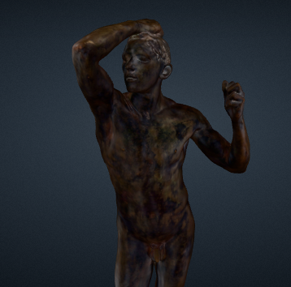
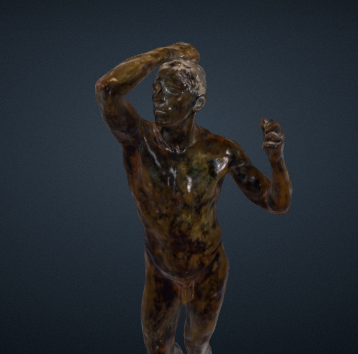

### What is Kintsugi?

Kintsugi is a 3D capture and rendering technique developed by researchers at the University of Wisconsin - Stout that allows for synthesizing material properties, like roughness and specularity, that 
are historically difficult to capture accurately. These improved material properties can lead to a render quality that more closely matches the "true" appearance of the object than 
traditional photogrammetry processing and rendering pipelines.

See the Voyager comparison below showing the improved visual quality with traditional photogrammetry output vs. Kintsugi.

*Voyager renderings of The Age of Bronze by Auguste Rodin, from the collection of the Minneapolis Institute of Art*

### How do I use Kintsugi?

Kintsugi assumes a 'flash-on-camera' capture technique, so the ideal pipeline would start with data captured under these lighting conditions.

Follow the [Kintusgi documentation](https://michaelt919.github.io/Kintsugi3DBuilder/Kintsugi3DDocumentation.pdf) for appropriate photogrammetric processing 
and [download the latest Kintsugi3DBuilder](https://github.com/michaelt919/Kintsugi3DBuilder/releases/latest) to setup and export your final glb models.

Drag-and-drop your glb model into [Voyager Story Standalone](https://3d.si.edu/voyager-story-standalone) or use any other Voyager scene creation method to see the result. Kintsugi-enabled 
models will be automatically detected and supported!