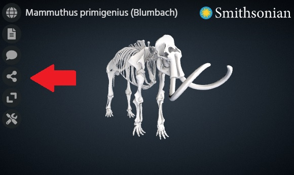

Voyager Explorer is a feature rich web component that you can embed along side other content in a web page.

### How do I embed the Explorer component in my webpage?

The following options for embedding can be achieved by just adding code you your webpage. No external installation or setup is required.

**Option 1: Embedding Smithsonian Collection Content**

Embedding a Smithsonian object can be done with a single html iframe tag. An example of the tag is shown below:

<iframe name="Smithsonian Voyager" src="https://3d-api.si.edu/voyager/3d_package:341c96cd-f967-4540-8ed1-d3fc56d31f12" width="800" height="450" allow="xr; xr-spatial-tracking; fullscreen"></iframe>


The long id number in the example above (341c96cd-f967-4540-8ed1-d3fc56d31f12) indicates that you want to load the Woolly Mammoth model. 

To load a different object, you would just replace that id with the appropriate one for the new model. 
This id can be found by going to the object's page at 3d.si.edu and looking at the end of the url. 

You can also copy the tag along with the proper id by clicking the "Share" button in the Explorer menu on the object page. 

 

**Option 2: Embedding the Component Directly**

If you want to use Voyager to show your own content or wish to make use of the Explorer API, you will need to embed the component directly.

Below is the minimum html needed to use Voyager Explorer with comments above each line describing its purpose.

**Note:** The voyager-explorer.min.js endpoint shown below will always give you the most recent version of Voyager. If you want to pin to or test out an older version,
just use an endpoint like the following with the appropriate version number: https://3d-api.si.edu/resources/js/v0.17.0/voyager-explorer.min.js


<!DOCTYPE html>
<html>
<head>
	<!-- This optional line provides a custom Voyager icon used for favorite/bookmarked pages. -->
	<link rel="shortcut icon" type="image/png" href="https://cdn.jsdelivr.net/gh/smithsonian/dpo-voyager@latest/assets/favicon.png"/>
	
	<!-- This stylesheet is recommended to load custom Voyager fonts. Not required, but may result in suboptimal UI without it. -->
	<link href="https://cdn.jsdelivr.net/gh/smithsonian/dpo-voyager@latest/assets/fonts/fonts.css" rel="stylesheet">
</head>
<body>
	<!-- This is the required Voyager tag. Customization can be done here via attributes. -->
	<!-- The 'root' attribute is the base path to your scene assets. -->
	<!-- The 'document' attribute is the name of your scene file -->
	<voyager-explorer root='https://3d-api.si.edu/content/document/341c96cd-f967-4540-8ed1-d3fc56d31f12/' document='document.json'></voyager-explorer>
	
	<!-- This is the required javascript file for the Voyager element. -->
	
</body>
</html>


### How do I display my own content in the Explorer component?

The Explorer component has it's own scene file format called SVX. This file is required to load models into the component as it describes all the non-geometry attributes of the scene - lighting, camera, annotations, etc.

You can [read more](../../document/overview) about this file format and [see an example here](../../document/example). See [How To: Create a scene file](../scene-create/) and then follow the steps below for configuration.

To display your own content in Explorer it must be accessible online and referenced in the SVX file. Then you must configure the component to point to the location of your content and scene file. This can be done in 2 ways, described below.

**Option 1: Voyager Explorer tag attributes**

You can set the location of your assets and the name of your scene file using the 'root' and 'document' attributes of the tag, respectively. An example of this is shown in the "Option 2: Embedding the Component Directly" section above using a Smithsonian 3D API endpoint as the location of our assets.

**Option 2: URL parameters** 

You can also supply the ['root' and 'document' attributes](../api) of the component through 'root' and 'document' URL parameters appended to the end of the page URL. This can be helpful if you want to create one page that can load different models depending on the link the user clicked to get there. 

An example of this is below:

https://www.my_website.com/my_voyager_scene.html?root=https://3d-api.si.edu/content/document/341c96cd-f967-4540-8ed1-d3fc56d31f12/&document=document.json


### Custom Properties
The Explorer component has several customizable properties. These properties can be provided as URL variables or as attributes of the custom HTML element.

See the [API documentation](../api/) for the full list of configurable attributes.