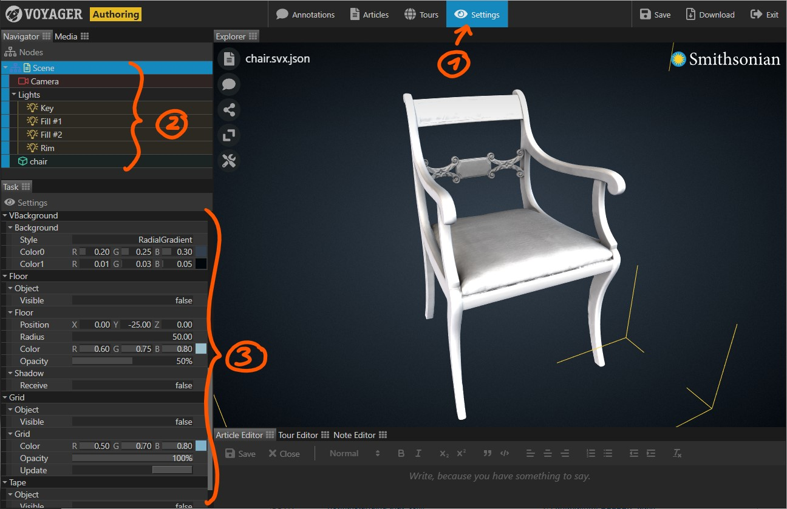

The Settings Task provides direct access to the parameters of each node in a scene. Use it to adjust scene settings,
model, light, and camera parameters.

1. Select the {} Task in the task bar.
2. In the navigator panel, select the node whose parameters you want to edit.
3. Adjust the parameters in the task panel.

