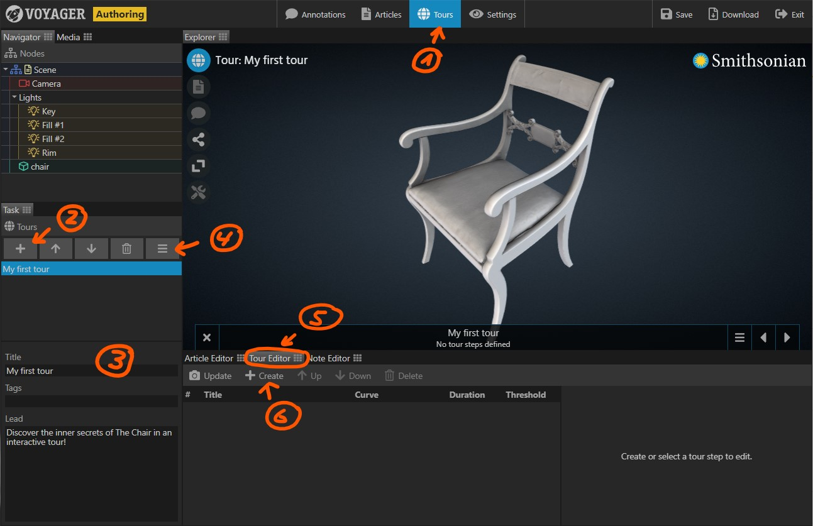

Provide guidance in your scene by creating _interactive tours_. A tour is an animated walk through a Voyager scene.
Each tour consists of a number of _steps_. The user navigates the tour by going from one step to the next. This is similar
to a PowerPoint presentation, where the user navigates from one slide to the next. However, Voyager tours are animated
in real time. At any time during a tour, the user can interact with the camera and the content of the scene.

During a tour, almost every single parameter of a Voyager scene can be animated. Using tours, you can for example

- Animate the camera to show the user various details on your model.
- Show and hide annotations programmatically
- Change material parameters to reveal the inner structure of a model.

The tours task provides the tools to create interactive tours.

{}

**Creating a new tour**

1. Select the {} Task in the task bar. 
2. In the task panel, click the {} button to create a new tour.
3. Enter a title and optionally a lead/description and some tags for the new tour.

- Use the {} and {} buttons to change the order of tours. The list order is also
  the order of the tours in the tour menu. 
- To delete a tour, select it, then click the {} button.
 

 
**Adding tour steps**
 
A tour consists of steps. Each step creates a snapshot of the scene's settings, including for example the camera position.
 
- (4) By default, when creating a tour step, only the camera is recorded. If you want to animate more features, click the
   feature menu button. From the menu, select the features you want to animate in your tour. A comprehensive feature
   list can be found at the end of this article.
- (5) Make sure the tour editor is visible by clicking its tab.
- (6) Adjust all scene settings including the camera to your liking. Then click the {} button to record
   the settings in a tour step.
   
- For each tour step, the editor provides a **Title**, **Curve**, **Duration**, and **Threshold** setting.
  - Give the step a descriptive **Title**. The step's title is displayed in the tour navigator.
  - The **Curve** determines how settings are interpolated between one step and the next. The default _EaseOutQuad_
    for example animates very quickly in the beginning and then slows down before reaching the next step.
  - The **Duration** determines how long the animation takes from the previous step to the current step.
  - The **Threshold** determines the switch point for settings which cannot be animated. A threshold of 0% switches
    the setting at the very beginning of the animation, a value of 50% switches the setting mid point.
    
- You can at any time replace the settings of a tour step with the current scene settings by selecting the tour step,
  then clicking the {} button.
- Use the {} and {} buttons to change the order of tour steps.
- To delete a tour step, select it, then click the {} button.

##### Animated Features

Clicking the **Feature** button opens the **Feature** menu. Here you can select which groups of settings are recorded in a tour. Note that the set of
selected features is the same for all tours in a scene. If you deselect a feature, previously recorded settings of
that feature are lost.

By default, only the state of the camera (navigation), and the reader (displayed article) are recorded.

Feature    | Included Settings
-----------|------------------
Interface  | (none, reserved for future use)
Reader     | Enabled, Article
Viewer     | Annotations Visible, Active Annotation, Active Tags, Shader, Exposure
Navigation | Camera Orbit, Camera Offset
Background | Color 0, Color 1
Floor      | Opacity
Grid       | Opacity
Tape       | Visible, Start Position/Direction, End Position/Direction
Slicer     | Enabled, Axis, Position
Tours      | (none, reserved for future use)
Models     | Position, Rotation, Scale
Lights     | Position, Rotation, Scale, Color, Intensity