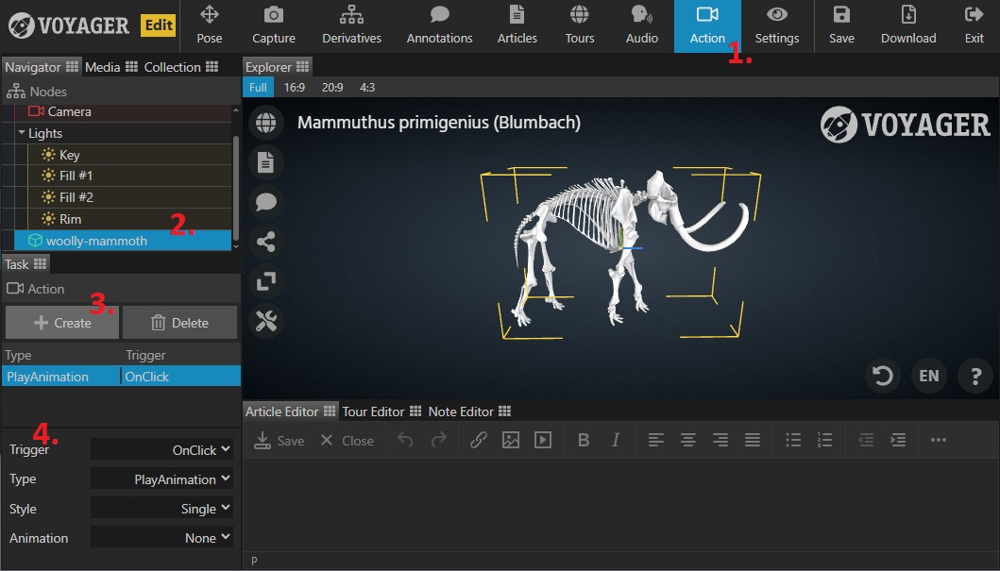

Use the Action Task to link triggers with actions like animation, audio (coming soon), etc, to create more dynamic and interactive scenes.

1. Select the {} Task in the task bar.
2. Select the model that this action will be attached to.
3. Click Create in the task panel to make a new action element or select an existing one to edit.
4. Set the action details as follows:
    - **Trigger** - What triggers this action? Options include "OnClick" (model click), "OnLoad" (scene load), or "OnAnnotation" (annotation activate).
    - **Type** - Options include "PlayAnimation" (starts a top-level object animation).
    - **Style** - How the action plays. Options include "Single", "Loop", or "PingPong" (alternating forward and backward on consecutive plays).
    - **Animation** - For action type "PlayAnimation", select the animation to play from the dropdown list.
    - **Annotation** - For trigger type "OnAnnotation", select the triggering annotation from the dropdown list.

Test the action by performing the designated trigger in the Explorer preview pane.

