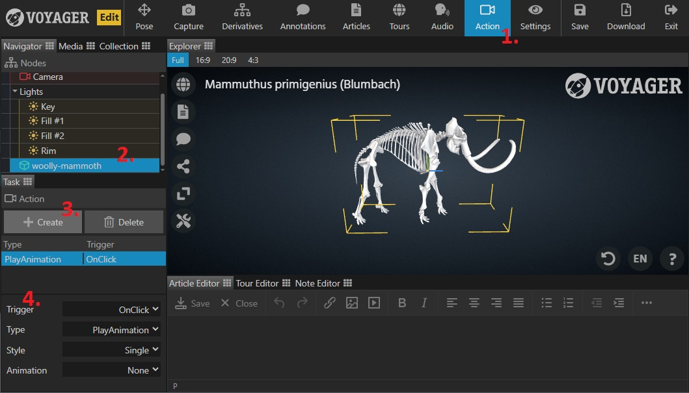

Use the Action Task to link triggers with actions like animation, audio (coming soon), etc, to create more dynamic and interactive scenes.

1. Select the {} Task in the task bar.
2. Select the model that this action will be attached to.
3. Click Create in the task panel to make a new action element or select an existing one to edit.
4. Set the action details as follows:
    - **Name** - Enter a recognizable name for the action.
    - **Trigger** - What triggers this action? Options include:
        - *OnClick* - when user clicks on the geometry associated with this action.
        - *OnLoad* - when all models in the scene are fully loaded.
        - *OnAnnotation* - when the defined annotation is activated (selected or opened, depending on annotation type).
        - *OnBeginAction* - when the defined action starts.
        - *OnEndAction* - when the defined action ends (currently only for animation actions). **Tip:** OnEnd and OnBegin triggers work across models, so are great for coordinating actions across objects.
    - **Type** - Options include:
        - *PlayAnimation* - starts an imported object animation.
        - *PlayAudio* - plays a top-level audio element (controls appear at top of the component).
    - **Style** - How the action plays. Options include:
        - *Single* - Plays one time.
        - *Loop* - Plays continuously.
        - *PingPong* - Plays one time, alternating forward and backward direction on consecutive triggers.
    - **Animation** - For action type "PlayAnimation", select the animation to play from the dropdown list.
    - **Speed** - For action type "PlayAnimation", define the playback rate. **Tip:** Set a negative speed to play the action backwards!
    - **ClampOnEnd** - For action type "PlayAnimation" and style "Single", indicates if the animation should pause on the last frame or reset to its initial state when finished.
    - **Annotation** - For trigger type "OnAnnotation", select the triggering annotation from the dropdown list.
    - **Action** - For trigger type "OnActionBegin" or "OnActionEnd", select the triggering action from the dropdown list.
    - **Audio** - For action type "PlayAudio", select the audio element from the dropdown list.
    - **SyncWith** - For action type "PlayAudio", select an object animation to sync the audio with from the dropdown list. **Tip:** Synching the audio ensures it will stay aligned with the animation through any audio pause/play interaction.

Test the action by performing the designated trigger in the Explorer preview pane.

**IMPORTANT NOTE** - Voyager is designed to operate under an assumption that one "model" equals one 3D object. It is still possible to import a 3D file with multiple objects in it,
but all of those objects are treated as one unit to operations within Voyager. Because of this, best practice is to import any animated objects as their own separate models to
avoid any potential issues.