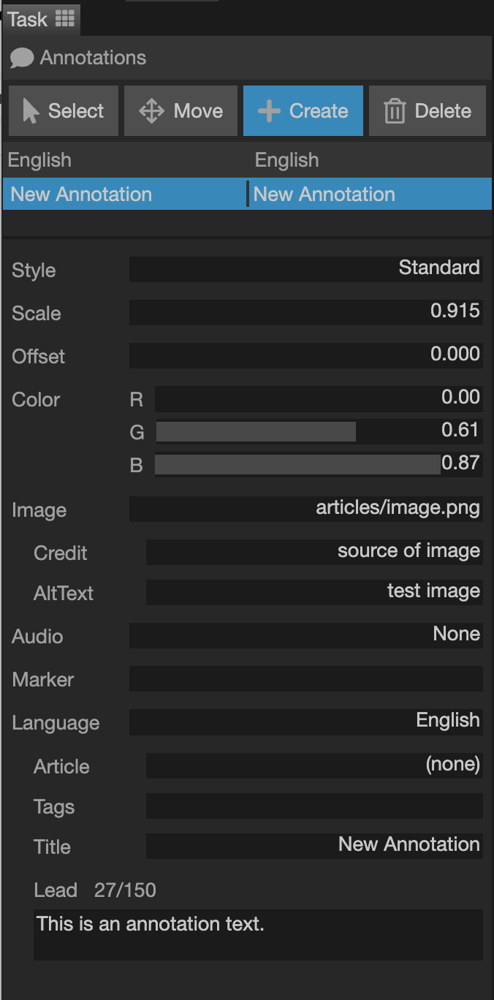
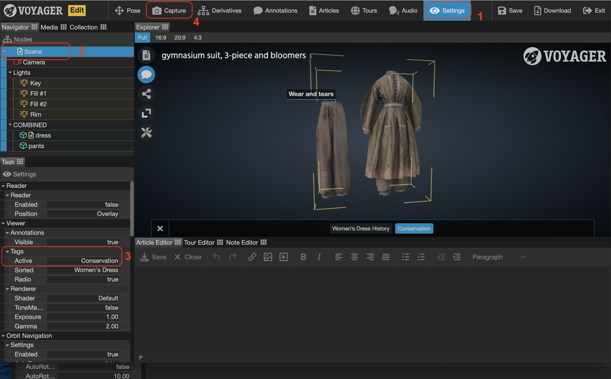

Use the Annotations Task to annotate a model in 3D space using customizable hotspot labels. Voyager uses annotations by XYZ point coordinates. Annotations in Voyager can be customized in a number of ways, see the sub-headings **Customize an Annotation** and **More Tips and Tricks for Annotations** to get help with how to configure annotations to suit your project goals. 

{}

 
<b>Create an Annotation</u></b>
  

1. In the $\color{red}{Top\text{ }Toolbar}$, click the ‘Annotations’ button.
2. Click on the 3D model in the $\color{lime}{Explorer\text{ }Window}$ in order to activate the Task Window. (N.B, if you have multiple models in the scene you need to select the one that will be associated with that specific annotation)
3. In the $\color{fuchsia}{Task\text{ }Window}$ click the ‘+ Create’ button.
4. Now, click anywhere on the 3D model in the $\color{lime}{Explorer\text{ }Window}$ to create your first annotation.
5. Go back to the $\color{fuchsia}{Task\text{ }Window}$ and click the ‘Select’ button to deactivate the creation mode.
6. Click the $\color{red}{Save\text{ }Workspace}$ button in the upper right area of the workspace.

 
<b>Move an Annotation</u></b>
 

1. Click the ‘Move’ button in the $\color{fuchsia}{Task\text{ }Window}$.
	* N.B. Make sure you have selected the correct annotation from the list of annotations. It will be highlighted in blue. 
2. In the $\color{lime}{Explorer\text{ }Window}$, click anywhere else on the model. The annotation should have moved to where you just clicked.
3. If you are satisfied with the location of the annotation then click the ‘Select’ button in the $\color{fuchsia}{Task\text{ }Window}$ to deactivate the ‘move’ mode.
4. Click the $\color{red}{Save\text{ }Worspace}$ button in the upper right area of the workspace.

 
<b>Customize an Annotation</u></b>

Annotations can be customized to suit the specific needs of the project. Below are basic parameters within the $\color{fuchsia}{Task\text{ }Window}$ that can be set for each annotation created. 

 
<b>1. Style</b> - The basic style of the annotation

 
* Standard - Only a title for the annotation is displayed 
* Circle - Annotation Titles are hidden until clicked. You can add lead, connect an article and add a Marker. 
* Extended - Annotation titles are displayed but can be clicked to display the lead text and/or the connected article.   

 
<b>2. Scale</b> - Changes the size of the annotation
 

* Only for Standard and Extended Style Annotations 
* Changes the length of the tail (distance between annotation label and the selected location on the model)

 
<b>3. Offset</b> - Changes the position of the annotation
 

* For all Annotation Styles 
* Changes the distance of the Annotation (including the tail) from your selected spot on the 3D model.

 
<b>4. Color</b> - Sets the color of the annotation
 
 
* For all Annotation Styles 
* RGB values to adjust the color of the annotation accent color
* useful for when you have annotation subgroups distinguished by color 

 
<b>5. Image</b> - Displays an image with the annotation (not yet available)
 
 
 

 
<b>6. Marker</b> - Small label for circle-style annotations
 
 
* Only for Circle Annotation Style 
* Add numbers, letters or words to the circle

 
<b>7. Language</b> - Defines the language of the annotation
 
 
* When using multiple languages, changes the language for editing the settings.

 
	
 
 

 
<b>8. Article</b> - Select an article to be displayed with the annotation

 
* For Circle and Extended Annotation Styles 
* Can only be used once articles exist in the project 
* Creates a 'Read more' link within an annotation that will open to a single Article that you specify from the drop-down list

 
	
	 

 
<b>9. Tags</b> - The tags associated with the annotation

 
* For all Annotation Styles 
* When you have many annotations in the 3D scene you can create subgroups for the annotations (tag)
* Just enter the name of the group in the Tags Field of your annotation and repeat this word exactly for the other annotations that fit into that group
* An annotation can have multiple tags (or groups)
* Multiple tags must be separated by a comma 

 
	
 

 
<b>10. Title</b> - The title text of the annotation

 
* For all Annotation Styles 
* Enter the name of the annotation 

    
	
	

 
<b>11. Lead</b> - The lead text of the annotation.

 
* For Circle and Extended Annotation Styles 
* Space for adding short descriptions with further descriptive details  
* Can be as long you want but best to keep it short
* Tip: If using both a Lead and Article Link it is a good idea to add an extra space under your lead by hitting enter after your last word in the Lead Text field. This creates extra space for the 'Read more' text and there isn't overlap
 

 
	

 
<b>More Tips and Tricks for Annotations</u></b>
 	
 
 
It is also possible to further customize annotation settings within Voyager Story. These objective-driven instructions will be helpful for accomplishing more with annotations. 
 
 

 
<b>How Do I...enable annotations by default when the page loads</b>

1. Click on the Settings button in the $\color{red}{Top\text{ }Toolbar}$
2. In the $\color{orange}{Media\text{ }Window}$, click on the Navigator tab and then select 'VScene' at the top of the list. 
3. In the $\color{fuchsia}{Task\text{ }Window}$, find the 'Viewer' →  'Annotations' → 'Visible' Setting and click on the word 'false' so that it changes to 'true'
4. Click on the Capture button in the $\color{red}{Top\text{ }Toolbar}$ 
5. In the $\color{fuchsia}{Task\text{ }Window}$, click on the 'Capture Button'
	* N.B. Clicking capture will capture everything that is set up in the scene so make sure the model is positioned in the way you want it to look when a user loads the webpage. It may also affect other aspects of the viewer/model so be careful when using the capture button.
6. $\color{red}{Save\text{ }Workspace}$ and reload the page to make sure the annotations are now visible by default. 

    

 
<b>How Do I...link an annotation with an article</b>

1. Click on the ‘Annotations’ button in the $\color{red}{Top\text{ }Toolbar}$
2. In the $\color{fuchsia}{Task\text{ }Window}$, click on the annotation you wish to link 
3. If you haven’t already done so, change the annotation Style from ‘Standard’ to ‘Extended’
4. Within the $\color{fuchsia}{Task\text{ }Window}$, find the field labeled ‘Article’. Click on the ‘(none)’ text next to it. 
5. Within the pop-up window, click on the article you wish to link from the list provided. 
6. $\color{red}{Save\text{ }Workspace}$
    

    

 
<b>How Do I...subgroup annotations by using the Tag feature</b>

 
 

1. Click on the ‘Annotations’ button in the $\color{red}{Top\text{ }Toolbar}$ 
2. In the $\color{fuchsia}{Task\text{ }Window}$, click on the individual annotation to display its properties
3. Find where it says ‘Tags’ and click on the empty field. 
4. Manually enter the annotation sub-group name you would like. 
    * N.B. If using multiple tags per annotation label, make sure the tags are separated by a comma
5. Repeat for the other annotations you wish to be in that same sub-group. 
    * N.B. Make sure the spelling is correct for each one so that the annotations are properly categorized. 
    * You can have as many sub-groups as you like. 
6. $\color{red}{Save\text{ }Workspace}$>
    
    

 
<b>How Do I...make only certain tags visible on load</b>

 

1. Click on the Settings button in the $\color{red}{Top\text{ }Toolbar}$
2. In the $\color{orange}{Media\text{ }Window}$, click on the Navigator tab and then select 'VScene' at the top of the list. 
3. In the $\color{fuchsia}{Task\text{ }Window}$, find the ‘Viewer’ → ‘Tags’ Settings, find the field that corresponds to ‘Active’ 
4. Enter the exact names of the tags that you wish to be visible by default when the page is loaded 
    * N.B. Make sure the tags are separated by a comma 
5. Click on the ‘Capture’ button in the $\color{red}{Top\text{ }Toolbar}$* 
6. In the $\color{fuchsia}{Task\text{ }Window}$, click on the 'Capture Button'
    * N.B. Clicking 'Capture' will record everything that is set up in the scene so make sure the model is positioned in the way you want it to look when a user loads the webpage. It may also affect other aspects of the viewer/model so be careful when using the capture button.
7. $\color{red}{Save\text{ }Workspace}$ and reload the page to make sure the specific annotations you want are now visible by default.

    

 
<b>How Do I...reorder the annotation tags</b>

 
 
1. Click on the Settings button in the $\color{red}{Top\text{ }Toolbar}$
2. In the $\color{orange}{Media\text{ }Window}$, click on the Navigator tab and then select 'VScene' at the top of the list. 
3. In the $\color{fuchsia}{Task\text{ }Window}$, find the ‘Viewer’ → ‘Tags’ Settings, find the field that corresponds to ‘Sorted’ 
4. Enter the exact names of the tags in the order that you wish for them to appear in the button groups 
    * N.B. Make sure the tags are separated by a comma 
5. Click on the ‘Capture’ button in the $\color{red}{Top\text{ }Toolbar}$* 
6. In the $\color{fuchsia}{Task\text{ }Window}$, click on the 'Capture Button'
    * N.B. Clicking 'Capture' will record everything that is set up in the scene so make sure the model is positioned in the way you want it to look when a user loads the webpage. It may also affect other aspects of the viewer/model so be careful when using the capture button.
7. $\color{red}{Save\text{ }Workspace}$ and reload the page to make sure the specific annotations you want are now visible by default. 

 
<b>How Do I...make tags viewable one at a time</b>

 

 

1. Click on the Settings button in the $\color{red}{Top\text{ }Toolbar}$
2. In the $\color{orange}{Media\text{ }Window}$, click on the Navigator tab and then select 'VScene' at the top of the list. 
3. In the $\color{fuchsia}{Task\text{ }Window}$, find the ‘Viewer’ → ‘Tags’ Settings, find the field that corresponds to ‘Radio’ 
4. Click on the word ‘False’ so that it now says ‘True’ 
    * N.B. the default setting of false means that all tags can be viewed simultaneously
5. Click on the ‘Capture’ button in the $\color{red}{Top\text{ }Toolbar}$* 
6. In the $\color{fuchsia}{Task\text{ }Window}$, click on the 'Capture Button'
    * N.B. Clicking 'Capture' will record everything that is set up in the scene so make sure the model is positioned in the way you want it to look when a user loads the webpage. It may also affect other aspects of the viewer/model so be careful when using the capture button.
7. $\color{red}{Save\text{ }Workspace}$ and reload the page to make sure the specific annotations you want are now visible by default. 

