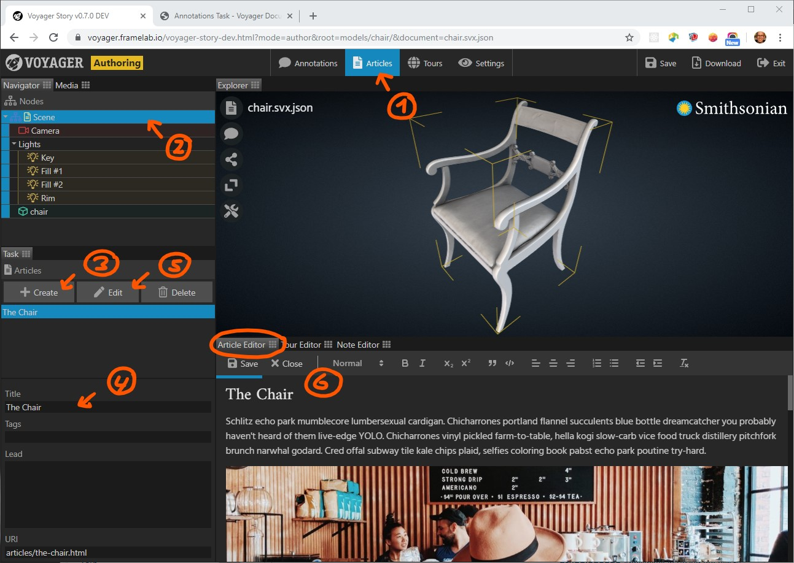
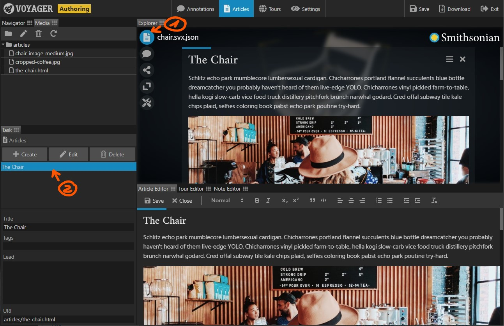

Write or import HTML formatted articles and associate them with a scene, model, or annotation.

{}

**Create and write a new article**

1. Select the {} Task in the task bar. 
2. Do you want to write an article for the current scene, or for a specific model in the scene? Select either the scene node or a model node.
3. In the task panel, click the {} button.
4. Enter a title and, optionally, a lead text and some tags for the new article.
5. Click the {} button.
6. Make sure the article editor is visible. Use the editor to edit the body text of the article.
7. When done, click the {} button in the article editor.

**Preview an article in the article reader**

1. Display the article reader by clicking the reader menu button in the Explorer panel.
2. From the article list, select the article to be displayed. If the article isn't updated, deselect it, then select it again.

To delete an article, select it from the list, then click the {} button in the task panel.
 
Note that this only deletes the article reference in the current scene. The article's HTML file and associated media files
(images, etc.) must be deleted manually using the media browser panel.

**Adding images to articles**

1. Make sure the media browser is visible. Click the **Media** tab next to the **Navigator** tab.
2. Drag and drop image files into the media browser. Use the media browser's menu to rename or delete files, and to create subfolders.
3. Open an article in the article editor. Select the article from the article list, then click the {} button. You can also double click the article to open it in the editor.
4. Drag and drop an image from the media browser into the article. Drop it at the desired position.
5. Clicking on a dropped image displays a menu for positioning and resizing the image.

**Note:** Article assets (.html, images, etc.) created by Voyager Story are stored in a ‘./articles’ folder relative to the loaded SVX scene file.