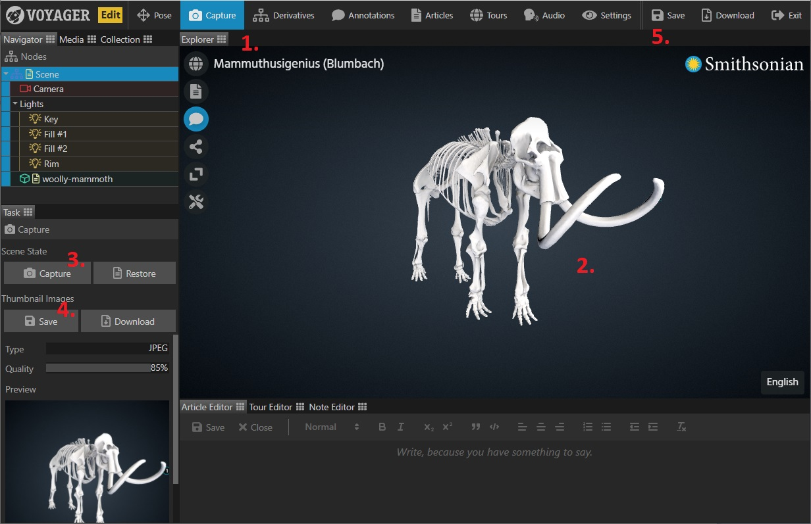

Use the Capture Task to save the current state of your 3D scene including 2D thumbnail images.

**Note: After adding your title don't forget to click 'Save' to write your changes to the scene file!**

{}

1. Select the {} Task in the task bar. 
2. Drag the view (orientation: left mouse button, pan: right mouse button, zoom: scroll wheel) until you're happy
with the scene view. This is the view the end user will see when they load the scene, so make sure you turn on annotations
or any other feature you may want in that initial view.
3. Click {} to take a snapshot. This saves the scene state to memory and the 2D snapshot appears in the task panel. If at any point 
you want to go back to a previously saved state, just click Restore.
**Note: At this point the the state is only saved to memory - you must click the 'Save' button in the task bar to save it to your scene!**
4. Click {} to save the 2D thumbnail back to the server.
5. Click {} in the top right to save these changes to the scene.

You can use the {} button next to the {} button to save a local copy
of the captured image.

