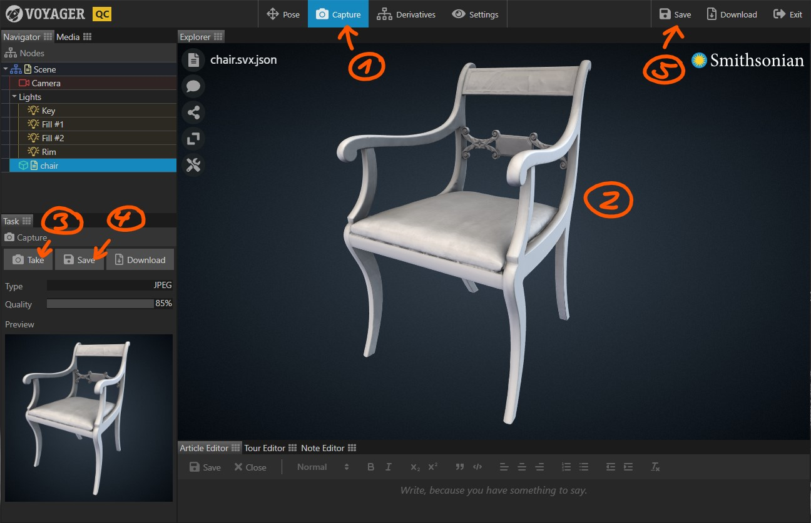

Use the Capture Task to create 2D snapshots of your 3D scene.

{}

1. Select the {} Task in the task bar. 
2. Drag the view (orientation: left mouse button, pan: right mouse button, zoom: scroll wheel) until you're happy
with the scene view.
3. Click {} to take a snapshot. The snapshot appears in the task panel. 
4. Click {} to save the snapshot back to the server.
5. Click {} in the top right to save the scene.

You can use the {} button next to the {} button to save a local copy
of the captured image.

