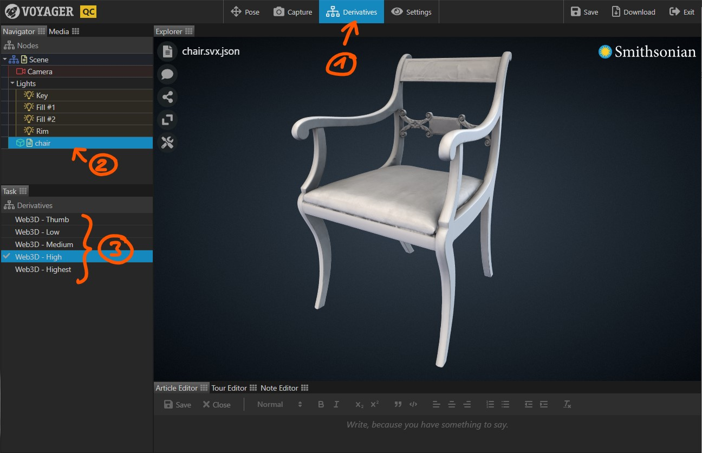

Use the Derivatives Task to inspect the various web derivatives your model consists of. Depending on your processing
pipeline, each model in a scene consists of multiple levels of detail.

{}

1. Select the {} Task in the task bar.
2. Select the model you want to inspect. A list of available derivatives appears in the task panel.
3. Select the derivative level you would like to inspect.

Level   | Description
--------|------------
Thumb   | The lowest available representation. Always loaded first, with the goal of displaying a first representation of the model as quickly as possible. We recommend using a compressed GLB file with a total size of less than 200k.
Low     | Used on older mobile devices. Maximum texture size: 1024 x 1024 pixels. Recommended mesh size: ~150k faces.
Medium  | Used on newer mobile devices. Maximum texture size: 2048 x 2048 pixels. Recommended mesh size: ~150k faces.
High    | Used on desktop devices. Maximum texture size: 4096 x 4096 pixels. Recommended mesh size: ~150k faces.
Highest | Used for quality inspection. Texture size: 4k or 8k. Mesh size: ~500k faces.

{}

