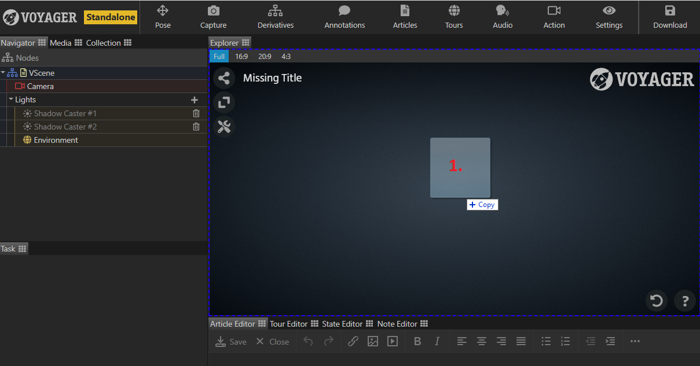
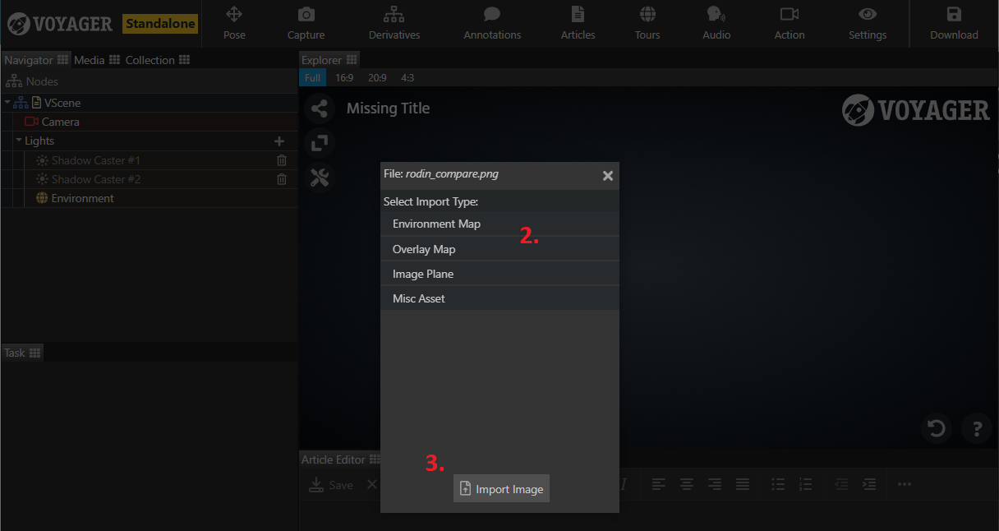

Images can be added to your Voyager scene in a number of different ways and for a number of different purposes.

**Adding content images: articles or annotations**

Please see the documentation for the [articles task](../articles-task/) or [annotation task](../annotations-task) for more information.

**Adding environments maps, overlays, or image planes**

If using Voyager Story in standalone mode or with asset drag/drop enabled:

1. Drag your image to the Explorer preview pane and drop.

2. Select an image purpose from the menu
	- Environment Map: This map will be added as a custom environment map option for this scene.
	- Overlay Map: Selecting this option will open a list of all models currently in the scene. This map will be added as an overlay to the selected model.
	- Image Plane: A new plane geometry will be added to the scene textured with this image. It will be initially sized at 100 scene units and the aspect ratio of the image.
	- Misc Asset: This image will just be added to your scene package for future content use. 

3. Click the "Import Image" button to lock in your choice and complete the import.

**If using a non-standalone or drag/drop enabled version follow the same steps as above but replace step 1 with dragging your image to the 
media pane as described in the [articles task](../articles-task/).**

