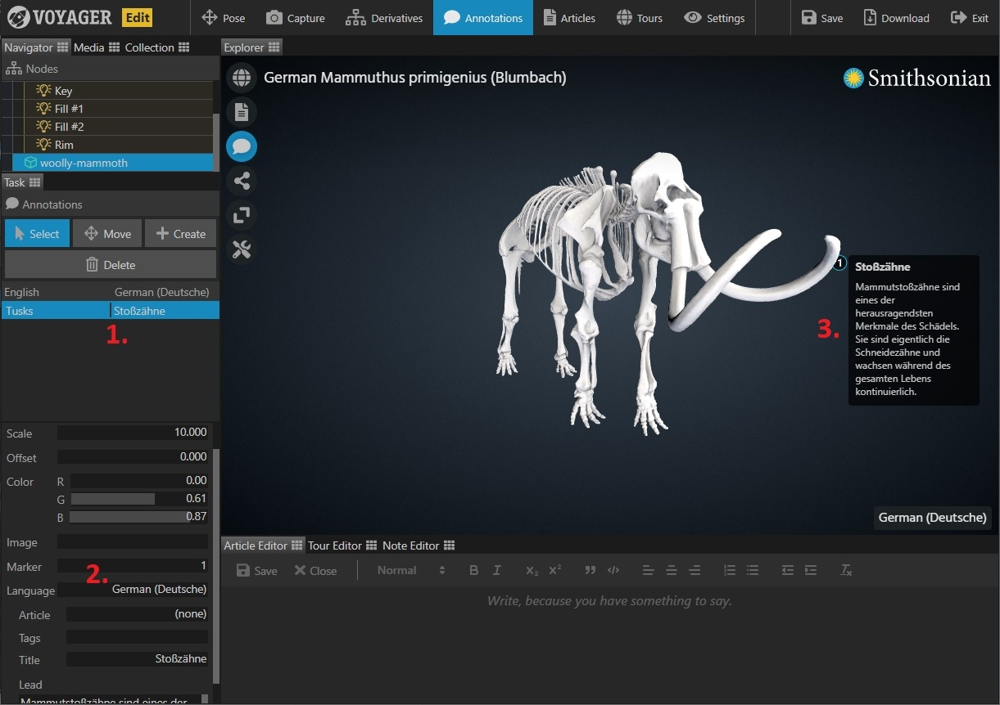
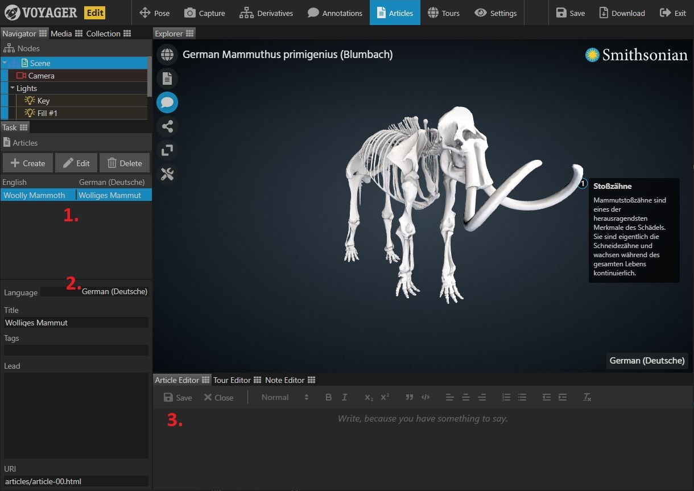
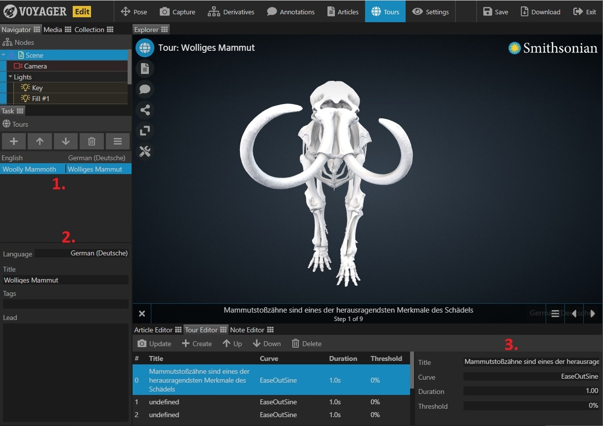
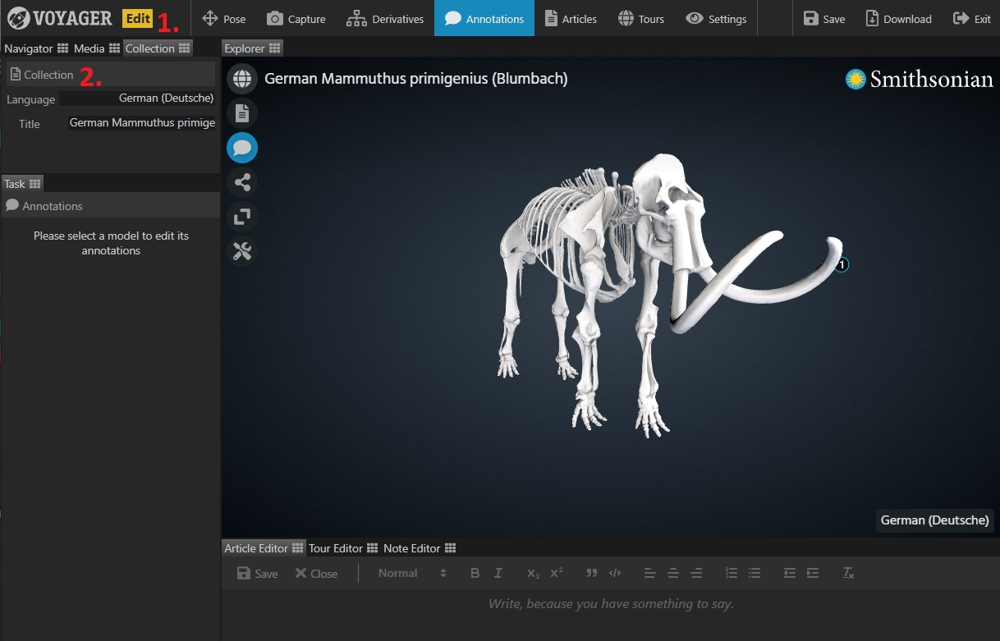

Voyager supports providing scene text in alternate languages that also have supporting language files for the UI. This currently includes English, Spanish, and German.

The alternate text is added in the Story component and will be reflected in the Explorer component when changing the language in the UI.

**Note: After adding your alternate language text don't forget to click 'Save' write your changes to the scene file!**

**Annotations**

1. The task panel will display the base language (defaults to English) and the currently selected language.

2. To add new content, just change the 'Language' drop-down to the desired language and enter the new text in the appropriate boxes.

3. Newly entered text will be immediately reflected in the visualization window.

**Articles**

1. The task panel will display the base language (defaults to English) and the currently selected language.

2. Select the desired language from the drop-down and enter a new title and lead. A language-specific article URI will automatically be generated.

3. Edit the new language version article in the editor as usual.

**Tours**

1. The task panel will display the base language (defaults to English) and the currently selected language.

2. Select the desired language from the drop-down and enter a new title and lead.

3. Add language specific tour step titles in the tour editor pane.

**Scene Title**

1. Click the 'Collection' tab at the top-left of the UI.

2. Select the desired language from the drop-down and enter a new scene title.