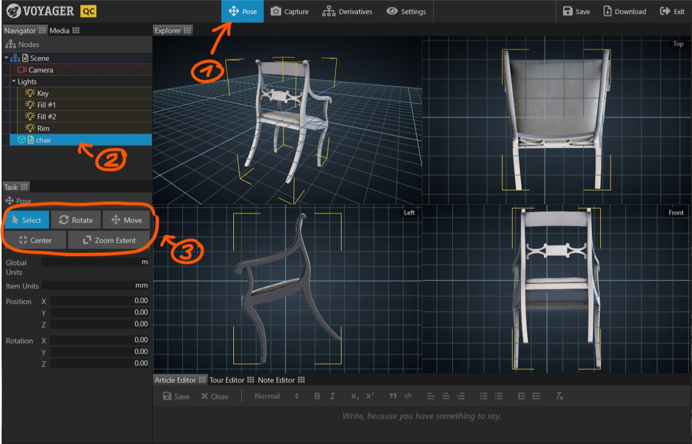

Often, after digitizing an object, the resulting 3D model is arbitrarily positioned in space. The Pose Task provides
tools to bring a model into its initial, upright position.

{}

1. Select the {} Task in the task bar. The viewer now displays a quad view with a perspective view
   in the top left quadrant, and an orthographic top, left, and front view in the three other quadrants.
2. Click on the model you want to position. A yellow selection marker appears around the model.
3. Select one of the pose tools and start positioning.

**Position the model**

- {} Drag with the left mouse button in one of the orthographic views to rotate the model.
- {} Drag with the left mouse button in one of the orthographic views to move the model.
- Click the {} button to position the model on the origin.

While dragging with the left mouse button, you can press the {} key to move 10 times faster and
the {} key to move 10 times slower.

**Adjust the view**

- Right click and drag in any view to pan the view
- Use the scroll wheel in any view to zoom the view
- Click {} to show the full model in all four views.

**Set model and global units**

- Choose which units to use globally by adjusting the {} parameter.
- Choose the units of the selected model by adjusting the {} parameter. 
