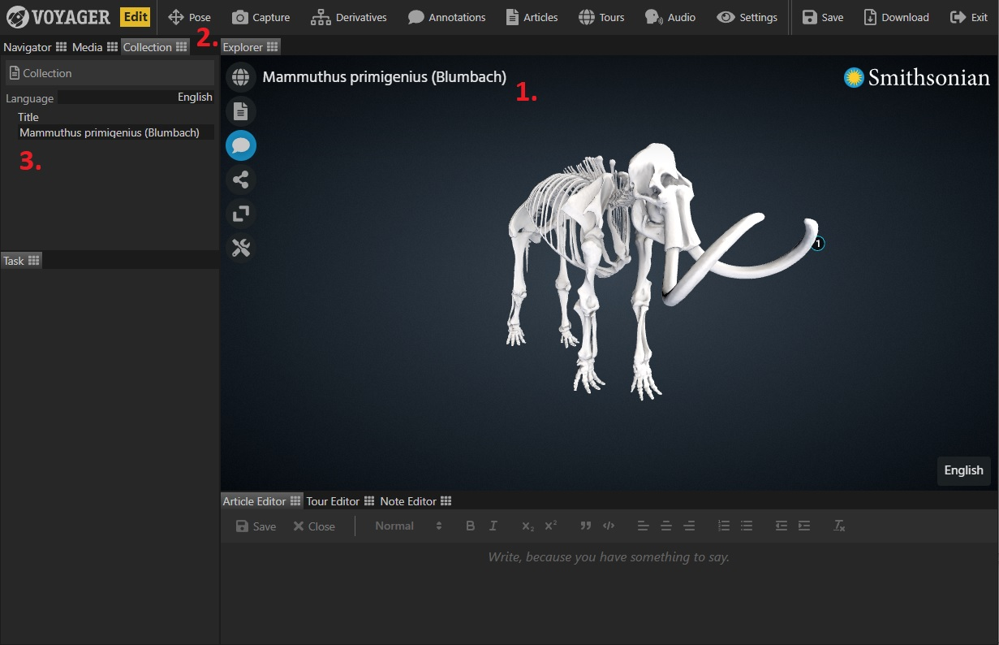

You can add or edit a scene title directly from the Voyager Story interface.

**Note: After adding your title don't forget to click 'Save' (upper right) to write your changes to the scene file!**

1. The scene title is displayed in the upper left hand corner of the Story preview window. If saved to the scene file, 
this title will appear in the same location when viewed in Voyager Explorer.

2. To add or edit a title, first click the 'Collection' tab in the upper-left corner.

3. Change the text in the 'title' textbox and see it immediately update in the preview window. The title element also has [Multilingual Support](../language-support).