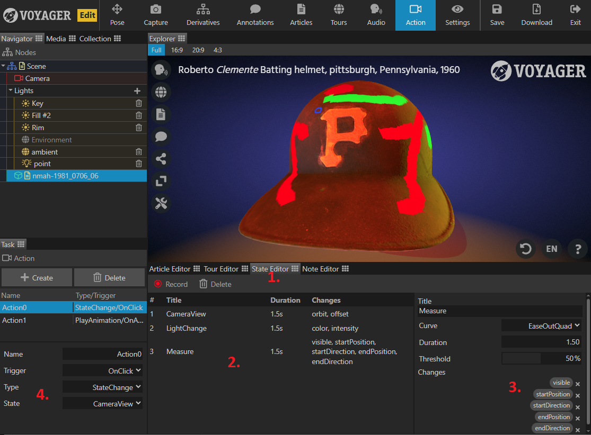

The State Editor tab allows you to create and save scene snapshots that can be dynamically triggered through Voyager actions.
This could be changin the camera view, light color, material property, etc. - anything that can be changed in a tour step.

Unlike tours, the state editor does not require you to enable the 'categories' of properties that you want to save. Anything change 
while the 'record' button is active will be saved to the snapshot. If anything unintentional was saved (a common example being a camera change), 
you can remove those properties by going to the state details in the lower right and clicking the 'x' by that specific change.

See the annotated image below for more details:

1. The state editor exists in a new tab, next to the tour editor.
2. Unlike the tour editor, the state editor uses a "record" button to track the delta between when you start making changes and when you next press "record". These state changes are also one-directional. They are only concerned with moving to the new state, not returning to the previous.
While creating states, use the 'Reset' or 'Default State' buttons to return to your pre-change state.
3. The state change details panel provides a list of all individual properties that changed during recording. This allows you to remove properties (like a camera movement) that may have been inadvertently tracked.
4. The Action task panel has a new action type of "StateChange" which will enable a dropdown showing all of the currently saved states. This action type is compatible with any of the existing trigger types.